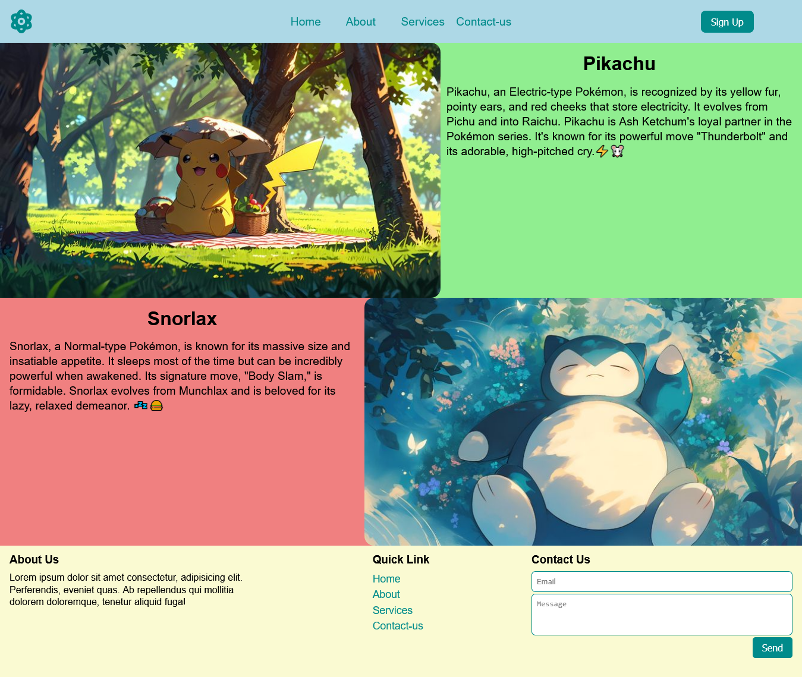

# GridGallery 🌟

Welcome to **GridGallery**, a beautiful website designed entirely with HTML and CSS, focusing on the **CSS Grid** layout system. 🚀 This project showcases a clean and not soresponsive design (for now) without the use of Flexbox, making it perfect for anyone who loves exploring the power of CSS Grid! 🎉

## 🌟 Features
- **Header Navigation**: Includes a logo, navigation links, and a sign-up button.
- **Hero Sections**:
  - Pikachu: Learn about the adorable electric Pokémon ⚡️🐭.
  - Snorlax: Discover the chilled-out and powerful Pokémon 💤🍔.
- **Footer**: Contains About Us, Quick Links, and a Contact Us form.

## 💻 Technologies Used
- **HTML**: Structure of the website.
- **CSS**: Styling and layout using CSS Grid.

## 🚀 How to Use
1. Clone this repository:
   ```bash
   git clone https://github.com/your-username/GridGallery.git
   ```
2. Open the `index.html` file in your favorite browser.

## 🎯 Goals of the Project
- Learn and apply CSS Grid layout.
- Create a visually appealing and functional web page without Flexbox.
- Showcase Pokémon-themed content with engaging design.

## 🖼️ Preview


## 🙌 Contributing
Contributions are welcome! Feel free to fork this repo, make improvements, and submit a pull request.

## 📃 License
This project is open-source and available under the MIT License.

✨ Made with ❤️ and a lot of CSS Grid magic! ✨
